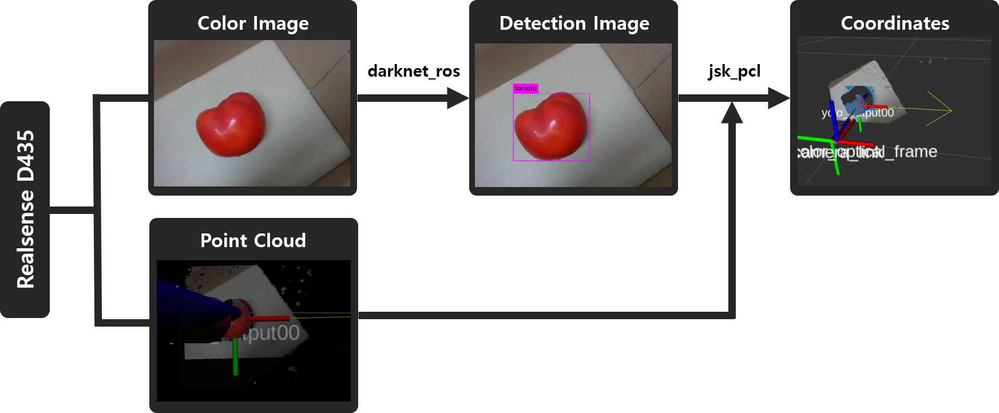
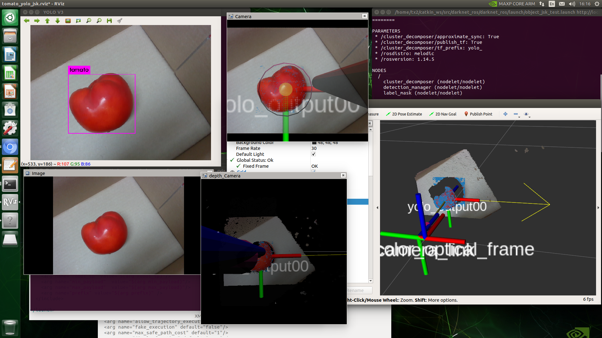

# object-detection

### Overview

This is a ROS package for detecting object by using camera. It detects only one label of things. 

- [darknet_ros(YOLO)](https://github.com/leggedrobotics/darknet_ros)
  for real-time detection object by making bounding box
- [jsk_pcl](https://github.com/jsk-ros-pkg/jsk_recognition)
  estimation coordinate detected object by darknet_ros(YOLO)

They are tested under JetsonTX2, ROS melodic and Ubuntu 18.04, OpenCV 3.4.6, CUDA Version: 10.0

reference : [hj_object_detect](https://github.com/MrLacquer/hj-object-detect) , [open-manipulator-object-tracking-apple](https://github.com/AuTURBO/open-manipulator-object-tracking-apple) (really thanks a lot!)




### Installation

If you want to use this package, please follow this procedure.

#### Dependencies

This package works on the ROS (Robot Operating System).

Please check your linux Version, before downloading ROS

- [melodic install (Ubuntu 18.04)](http://wiki.ros.org/melodic/Installation/Ubuntu)

- [kinetic install (Ubuntu 16.04)](http://wiki.ros.org/kinetic/Installation/Ubuntu)

YOLO depends on the OpenCV (at least 3.4.x) 

- [Opencv 3.4.6 (on JetsonTX2)](https://jkjung-avt.github.io/opencv-on-nano/)

  (my) ROS default python package is `python2.7`. so I changed shell script a little for installing OpenCV 3.4.6 on python2. [Here](https://github.com/mywnajsldkf/object-detection/blob/master/doc/install_opencv-3.4.6.sh) is shell script that I changed.

  - more details about ROS with Python version please refer [this page](https://medium.com/@beta_b0t/how-to-setup-ros-with-python-3-44a69ca36674)

- CUDA 10.0

  I passed this state. Because I already installed it setting up JetsonTX2 with Jetpack4.3 before.

  - CUDA Version depends on your GPU. [check it](https://en.wikipedia.org/wiki/CUDA)!

- If you don't have any package. please follow this procedure.

  ```
  $ mkdir -p ~/catkin_ws/src
  $ cd ..
  $ catkin_make	# build, devel, src directory will be made
  $ source ~/catkin_ws/devel/setup.bash	# register workspace
  ```
  
- darknet_ros

  ```
  $ cd ~/catkin_ws/src
  $ git clone --recursive https://github.com/leggedrobotics/darknet_ros.git
  $ cd ..
  $ catkin_make -DCMAKE_BUILD_TYPE=Release
  $ rospack profile
  ```

- [IntelRealSense](https://github.com/IntelRealSense)

  - download [Intel Realsense SDK](https://github.com/IntelRealSense/librealsense/releases)
  - [realsense-ros](https://github.com/IntelRealSense/realsense-ros)
  - please check the real sense-ros version because it depends on intel Realsense SDK.

  ```
  $ cd ~/catkin_ws/src
  $ git clone https://github.com/pal-robotics/ddynamic_reconfigure.git
  
  after install realsense-ros
  
  $ cd ..
  $ catkin_make
  ```

- [jsk_recognition](https://github.com/jsk-ros-pkg/jsk_recognition)

  ```
  sudo apt-get install ros-melodic-jsk-recognition
  sudo apt-get install ros-melodic-jsk-topic-tools
  
  $ cd ~/catkin_ws/src
  $ git clone https://github.com/jsk-ros-pkg/jsk_common.git
  ```

- packages

  ```
  $ sudo apt-get install ros-melodic-octomap-server
  $ sudo apt-get install ros-melodic-nodelet
  $ sudo apt-get install ros-melodic-depth-image-proc
  $ sudo apt-get install ros-melodic-rtabmap-ros
  $ sudo apt-get install ros-melodic-navigation
  ```


### start!

```
$ cd object-detection

in config directory
$ cp -r ros.yaml ~/catkin_ws/src/darknet_ros/darknets_ros/config
$ cp -r tomato.yaml ~/catkin_ws/src/darknet_ros/darknet_ros/config
$ cp -r tomato_yolo_jsk.rviz ~/catkin_ws/src/darknet_ros/darknet_ros/config

in launch directory
$ cp -r bringup_d435.launch ~/catkin_ws/src/darknet_ros/darknet_ros/launch
$ cp -r darknet_ros.launch ~/catkin_ws/src/darknet_ros/darknet_ros/launch
$ cp -r object_detect_rviz.launch ~/catkin_ws/src/darknet_ros/darknet_ros/launch
$ cp -r object_detection.launch ~/catkin_ws/src/darknet_ros/darknet_ros/launch
$ cp -r object_jsk_test.launch ~/catkin_ws/src/darknet_ros/darknet_ros/launch

$ cd ~/catkin_ws/src/darknet_ros
$ mkdir script

in script directory
$ cp -r object_collector.py ~/catkin_ws/src/darknet_ros/darknet_ros/script

in src directory
$ cp -r YoloObjectDetector.cpp ~/catkin_ws/src/darknet_ros/darknet_ros/src
$ cp -r yolo_object_detector_node.cpp ~/catkin_ws/src/darknet_ros/darknet_ros/src

in include/darknet_ros
$cp -r image_interface.h
~/catkin_ws/src/darknet_ros/darknet_ros/include/darknet_ros
$cp -r YoloObjectDetector.hpp
~/catkin_ws/src/darknet_ros/darknet_ros/include/darknet_ros

in yolo_network_config/cfg/
$ cp -r tomato.cfg ~/catkin_ws/src/darknet_ros/darknet_ros/cfg
```

Weight file Download [link](https://drive.google.com/file/d/1f615qxgQMaswqy6ZJyNqtfsV400mJbBY/view?usp=sharing)

```
$ cp -r tomato_30000.weights ~/catkin_ws/src/darknet_ros/darknet_ros/yolo_network_config/weights
```

Launch

```
$ roscore
$ roslaunch darknet_ros object_detect_rviz.launch
$ roslaunch darknet_ros object_jsk_test.launch
$ rosrun darknet_ros object_collector.py	# distance from object
```


### Result




